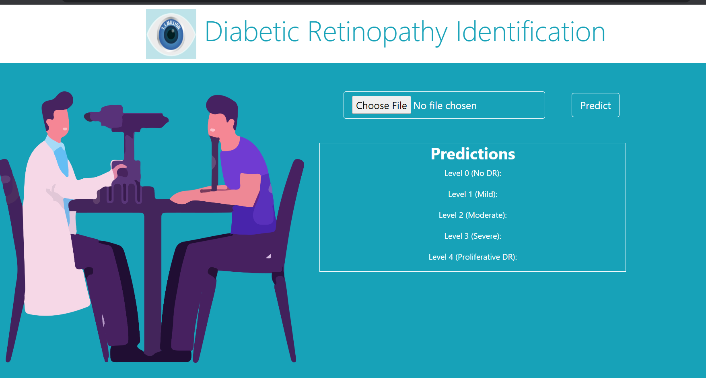

## About the Project

Implemented and developed a project focused on the diagnosis of Diabetic Retinopathy, utilizing TensorFlow Keras to fine-tune a pre-trained VGG16 model. The model was specifically customized to classify the severities of Diabetic Retinopathy, providing accurate predictions and aiding in medical diagnosis.

Designed and created an intuitive client interface to facilitate seamless interaction with the model. Leveraging Flask for the backend and HTML for the frontend, the interface was meticulously crafted to ensure user-friendliness and accessibility. Additionally, CSS was employed to enhance the design aesthetics, resulting in an aesthetically pleasing and visually appealing interface.

Deployed the project on an AWS EC2 instance, ensuring robust and scalable hosting capabilities. This deployment allowed for seamless accessibility of the diagnostic tool from various platforms and ensured reliable performance under varying workloads.

Through this project, demonstrated proficiency in TensorFlow Keras, effectively fine-tuning a pre-trained VGG16 model to cater to the unique classification requirements of Diabetic Retinopathy severities. Developed strong skills in designing and implementing a user-friendly client interface, utilizing Flask, HTML, and CSS to create a seamless and visually appealing user experience. Successfully deployed the project on an AWS EC2 instance, providing a reliable and scalable solution for medical diagnosis.

Overall, this project exemplified a comprehensive understanding of machine learning, web development, and cloud deployment, combining technical expertise with a focus on improving healthcare outcomes through innovative solutions.

### Built With

- [](https://www.python.org/downloads/)
- [](https://www.tensorflow.org/install)
- [](https://keras.io/getting_started/)
- [](https://jupyter.org/)
- [](https://flask.palletsprojects.com/en/2.3.x/installation/)
- [](https://opencv.org/)
- [](https://aws.amazon.com/ec2/)
- [](https://developer.mozilla.org/en-US/docs/Glossary/HTML5)
- [](https://developer.mozilla.org/en-US/docs/Web/CSS)

## Getting Started

### Prerequisites

To run this project, you will need:

- Python installed on your development machine. To install [Python](https://www.python.org/downloads/), follow the link. By having Python installed you will also have pip installed.
- Any editor of your choice. Personally, I use [Visual Studio Code](https://code.visualstudio.com/download) for all my projects.

### Installation

1. Clone the repo
   ```markdown
   https://github.com/bhaven123/Project-Diabetic-Retinopathy
   ```
2. Install project dependencies
   ```markdown
   pip3 install -r requirements.txt
   ```

## Usage

- To run the model, simply type the following command in a terminal inside the project root folder.
  ```
  jupyter notebook
  ```

### Screenshots



## Contact

- Bhaven Naik - [naikbhaven11@gmail.com](mailto:naikbhaven11@gmail.com) | Portfolio - [https://bhaven-naik.com/](https://bhaven-naik.com/)
- Project Link: [https://github.com/bhaven123/Project-Diabetic-Retinopathy](https://github.com/bhaven123/Project-Diabetic-Retinopathy)
